# О проекте

Программа предназначена для упрощения работы сотрудников диспетчерской службы в тепловой энергетике. Данная программа предусматривает множество инструментов для удобства работы сотрудника в течении его смены.
Далее будут представлен весь инструментарий с его подробным описанием. 

# Основное окно

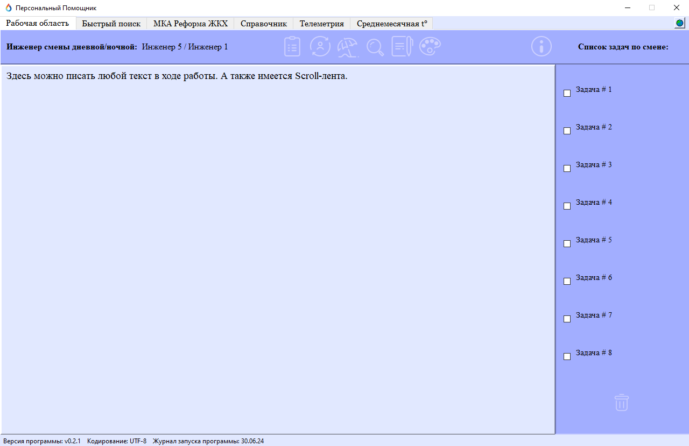

Данное окно открывается при запуске программы. Состоит из нескольких блоков для взаимодействия, а именно: **Рабочая область**, **Кнопки**, **Список задач** и **Вкладки**.

## 1. Рабочая область
В данной области имеется textarea, где сотрудник может в свободной форме фиксировать полученную информацию из разных источников. 
- Активны горячие клавиши и работа с текстом с помощью меню по клику правой кнопки мыши. 
- Также для удобства восприятия - текст не поддерживает исходное форматирование при вставке его из других источников.

При загрузке программы происходит автоматическое обновление и выгрузка информации в данную область из txt-файла. 
При закрытии программы происходит автоматическое сохранение всей информации в данной области в служебный файл, а также закрытие всех дочерних окон программы. 

## 2. Список задач на смену

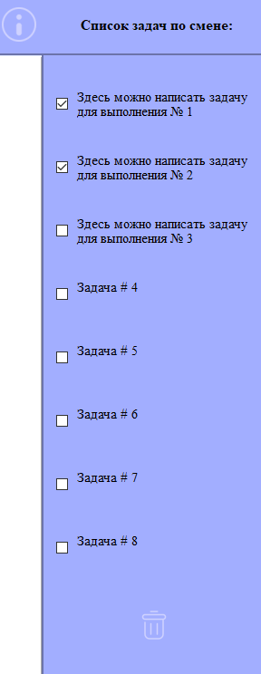

Представляет из себя блок с 8-ью checkbox с помощью которых сотрудник в текстовом виде может планировать необходимые к выполнению задачи в течении своей смены. А выполненные задачи можно отмечать, чтобы видеть прогресс. 
> Каждый box имеет scroll-ленту и неограниченный объём текста. 

Для удобства предусмотрена кнопка **удаления задач**. 
Её механика работы заключается в том, что при активации она очищает текстовую область задачи и возвращает ей исходный текст, но производит эту манипуляцию **ТОЛЬКО** с теми задачами, которые отмечены галочкой.

## 3. Сотрудники в смене

В данном label указывается какие сотрудники находятся на текущий день в смене: дневной и ночной. 
При загрузке программы происходит автоматическое обновление и выгрузка информации в данную область из xlsx-файла. 
- Также реализовано автоматическое обновление данной области ежедневно в 08:00, когда происходит смена сотрудников. 

## 4. Вкладки

Реализована возможность просмотра Интернет-страниц в специализированно выделенных вкладках через стандартный веб-движок PyQt6.
> Все страницы открываются внутри текущей вкладки, а также имеется функция перетаскивания вкладок для удобства их расположения. 

Предусмотрена кнопка **"Домой"**, которая позволяет вернутся сразу на исходную веб-страницу по умолчанию. 
Вкладки включают в себя: 
- **Быстрый поиск** - страница Яндекс для поиска любой необходимой в работе информации;
- **Справочник** - локальный сайт диспетчера данной организации для доступа к необходимой в ходе работы информации;
- **Телеметрия** - доступ к рабочему серверу с мониторингом статуса и состояния тепловых объектов;
- **МКА Реформа ЖКХ** - сайт для осуществления рабочей деятельности с целевого профиля.

# Кнопки

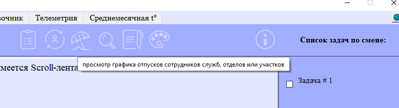

Панель активных инструментов для облегчения работы сотрудников диспетчерской службы. 
> Все кнопки обладают интерактивной подсказкой при наведении курсора. 

## 1. Информация по смене

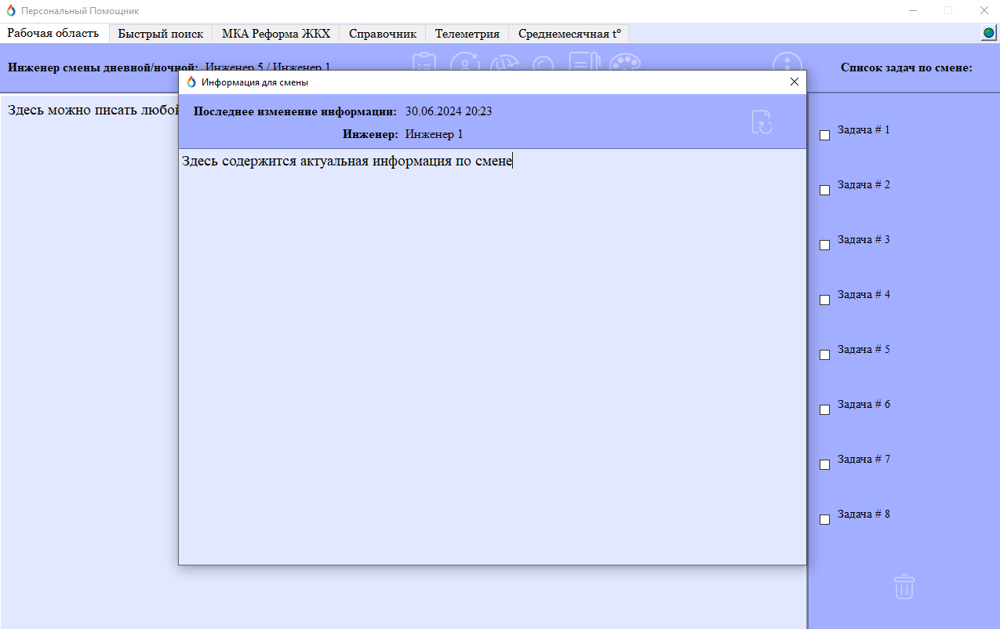

В данной области имеется textarea, где сотрудник может в свободной форме фиксировать необходимую информацию из разных источников для будущей смены. 
- Активны горячие клавиши и работа с текстом с помощью меню по клику правой кнопки мыши. 

Обновление информации осуществляется сотрудником смены в данном окне - для этого предусмотрена кнопка **сохранения данных**. 
При загрузке программы происходит автоматическое обновление и выгрузка информации в данную область из txt-файла. 
> А также указывается дата изменения служебного файла, когда в него были внесены изменения и Ф. И. О. сотрудника, который в тот день находился в дневной или ночной смене в зависимости от времени изменения файла.

## 2. График сотрудников

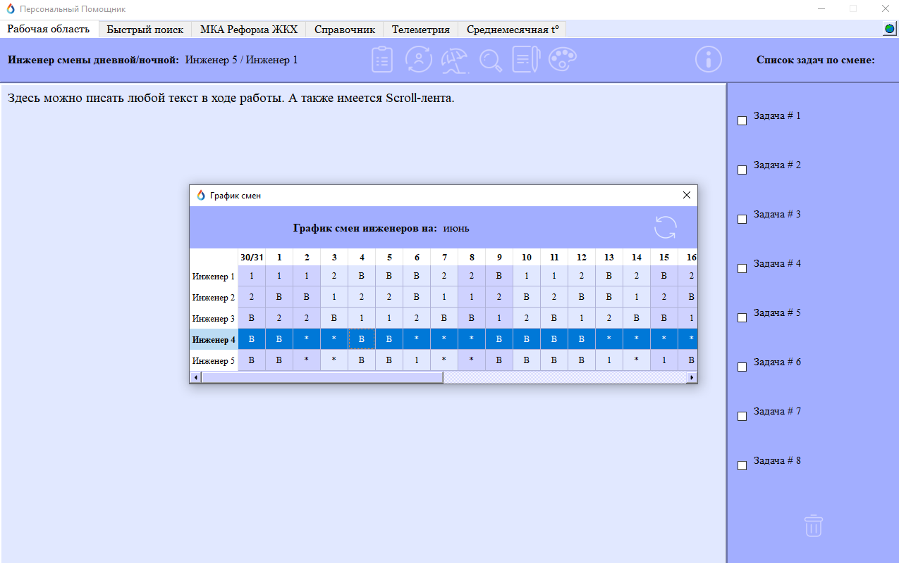

Открывает окно для просмотра таблицы о графике работы сотрудников диспетчерской службы. 
> При загрузке программы происходит автоматическое обновление и выгрузка информации в данную область из xlsx-файла. 

Обновление служебной таблицы с графиком дежурств осуществляется в ручном режиме сотрудниками по необходимости: через обыкновенную программу Excel.
Также после изменения файла - предусмотрена кнопка: **"Обновления и отображение актуальной информации"**, которая была внесена вручную сотрудником. 
- Данный график охватывает все дни месяца с 1 по 31, а также предыдущий день месяца 30/31. 
- Для удобства ориентирования по графику при левом щелчке мыши производится выделение строчки того или иного сотрудника.

## 3. График отпусков

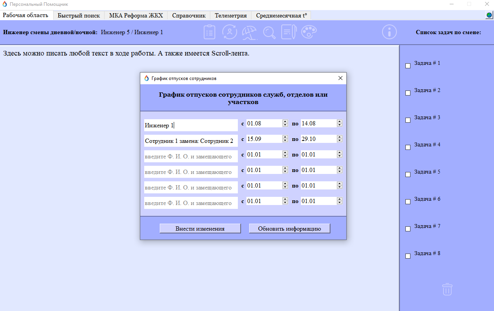

Открывает окно для просмотра таблицы о графике отпусков сотрудников организации. 
> При загрузке программы происходит автоматическое обновление и выгрузка информации в данную область из json-файла. 

Обновление графика осуществляется сотрудником смены в данном окне с выбором даты начала и окончания отпуска, а также описанием Ф. И. О. лица находящегося в отпуске и лица его замещающем. 
Для этого предусмотрена кнопка **сохранения данных**. 
> При необходимости возможно обновление файла в ручном режиме, для обновления информации внутри программы в связи с этим предназначена кнопка: **"Обновления и отображение актуальной информации"**.
- Для удобства работы данный график при отображении охватывает только день и месяц.
  
## 4. Просмотр файлов

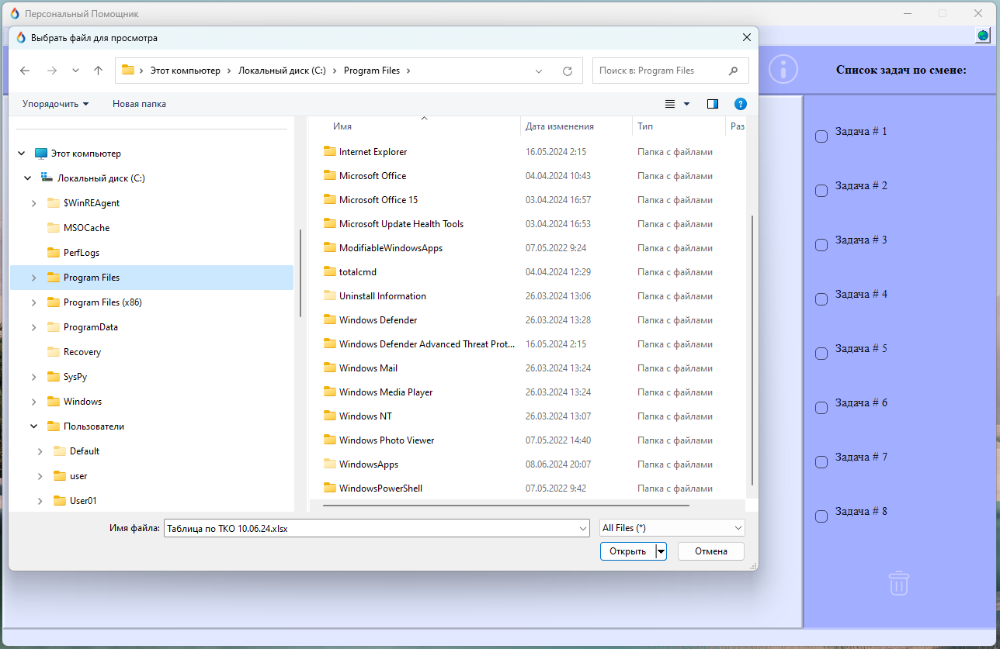

Данная кнопка открывает менеджер диалогового окна из которого можно быстро попасть в любую папку Windows и открыть любой файл необходимый для просмотра или изменения в ходе работы.
По умолчанию задана папка в которой находится сама программа.

## 5. Изменение excel

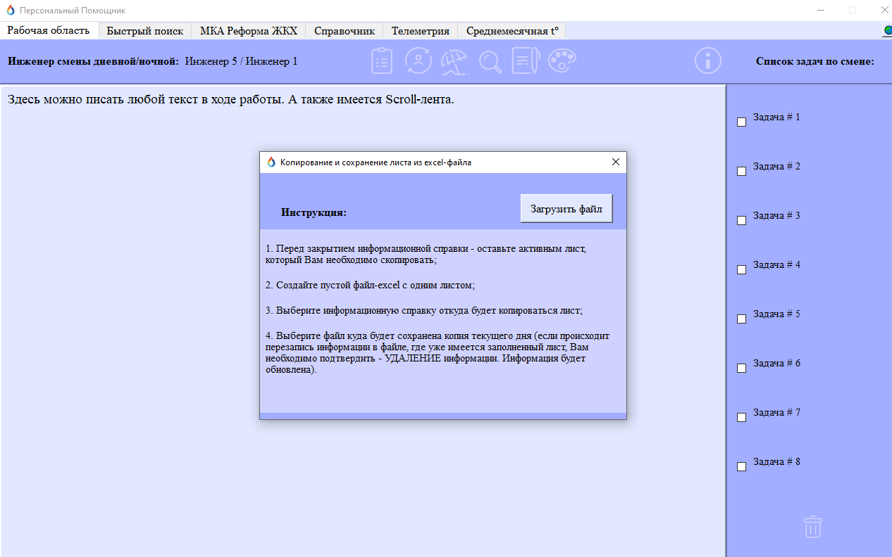

В данном окне реализован алгоритм загрузки xlsx-файла - копирование его активной страницы и сохранение данной страницы в другой xlsx-файл с удалением предыдущей, чтобы файл имел только одну страницу. 
Сделано это для формирования отчётов с 1 страницей, чтобы сотрудники не занимались ручным пересоздаванием файла, а программа выполняла данную работу автоматически.
> Для удобства сотрудников в данном окне: написана пошаговая инструкция по работе с алгоритмом. 

## 6. Изменение цвета

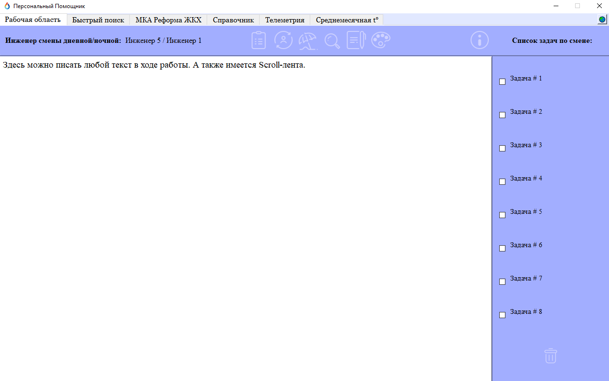

Данная кнопка способна менять цвет текстовой рабочей области в основном окне на белый и обратно на стандартный для текущей цветовой гаммы программы. 
> Данная кнопка была добавлена по просьбе сотрудников при работе в ночную смену.

## 7. Информация о программе

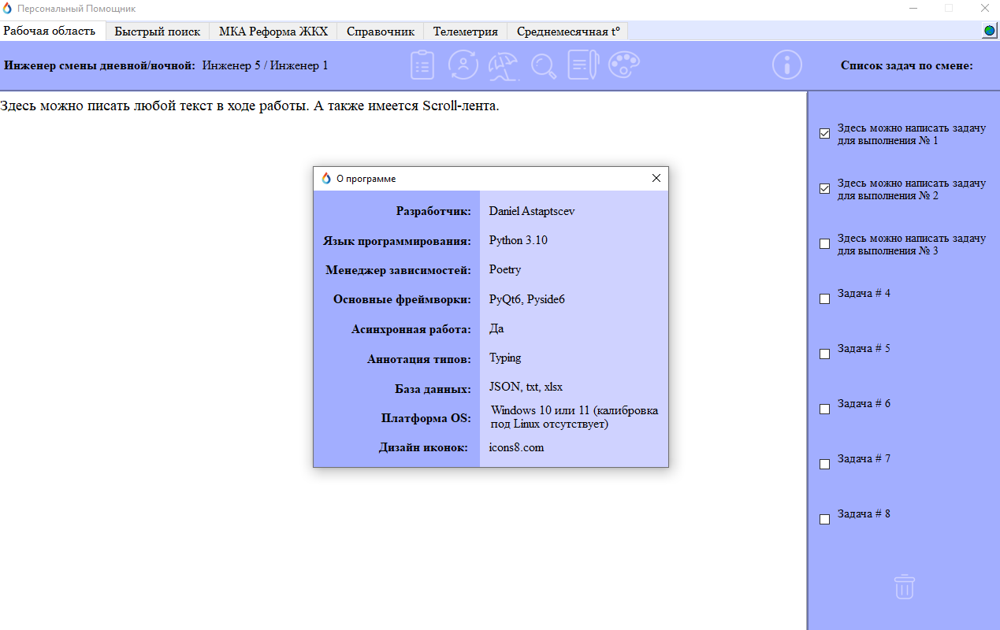

Окно с краткой технической информацией по программе. 

# Парсинг погоды

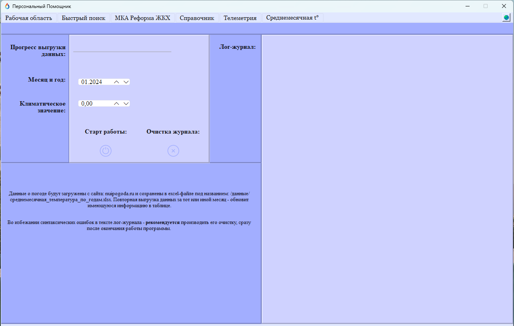

Данный алгоритм предназначен для осуществления парсинга сайта погоды, а именно: "Ну и погода". 
Он собирает на нём ежемесячные значения: 
- минимальная средняя температура;
- максимальная средняя температура.

По определённым муниципальным районам и городским округам, которые закреплены за данной организацией, а затем переносит собранные значения в таблицу xlsx-файла.

## 1. Старт работы
Необходимо выбрать **месяц и год** за который будут собраны данные с целевого сайта, а также **климатическое значение** для проведения дополнительных расчётов. 
По умолчанию - алгоритм предусматривает сбор данных за отопительный период, а именно месяцы: 
- Сентябрь;
- Октябрь;
- Ноябрь; 
- Декабрь;
- Январь;
- Февраль; 
- Март; 
- Апрель.

## 2. Прогресс работы
Имеется шкала отображения прогресса парсинга сайта и загрузки собранных данных в excel-таблицу с полной пошаговой отчётностью в лог-журнал. 

## 3. Заполнение и очистка лог-журнала
При запуске программы все действия алгоритма отображаются в специальной зоне: **лог-журнале**. 
Алгоритм предусматривает методику перехвата ошибок и их непосредственного отображения, чтобы сотрудник видел, что программа отработала некорректно. 
- Также, по окончанию работы алгоритма предусмотрена возможность очистки зоны лог-журнала. 

# Ошибки
По возможности, все места с кодом, где могут возникнуть критические ошибки в виду: 
- удаления служебных файлов;
- некорректного введения данных;
- неверного отображения информации;
- и т. д.

Перехватываются, а затем выводится системное уведомление для обозначения сотруднику, что произошла критическая ошибка в ходе работы алгоритма.  
